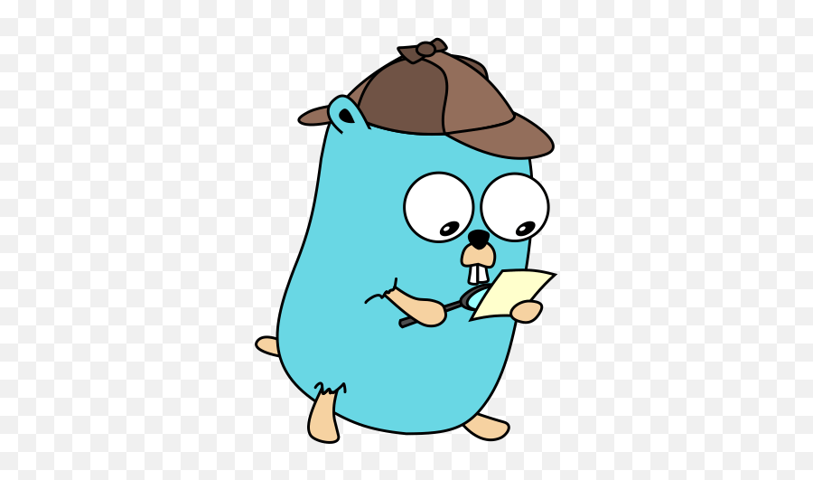

# design-patterns-golang

Curated list of design patterns using Golang

This repo contains list of design pattern that are implemented using Golang. Each pattern has notes written along with simpler explanation of that pattern.

If you have anything to add or contribute, feel free to fork and create a PR.
