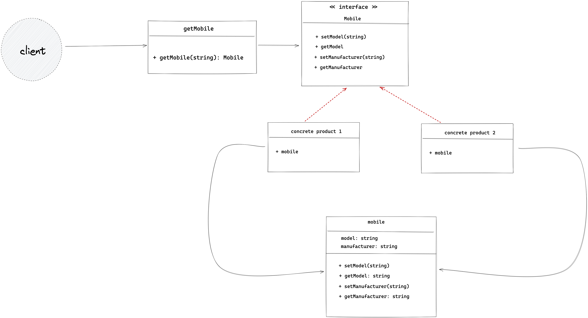

Factory pattern falls under creational design pattern which solves the problem of creating the objects without
specifying their concrete classes.

It provides a way to hide the creation logic of the instance being created. Client interacts with the factory class & tells the kind of instance that
needs to be created. The factory class interact with the correct concrete class and returns the proper instance to the client.

In this example program,

1.  we have the `Mobile` interface which exposes all the methods that client needs related to the mobile.
2.  `mobile` struct that implements that interface.
3.  Two concrete classes `Android` & `IOS` both embeds `mobile` type, so indirectly implements all the methods belongs to the `Mobile` interface.
4.  we have `getMobile` struct which creates instance based on the input mobile device (either android or iOS).

